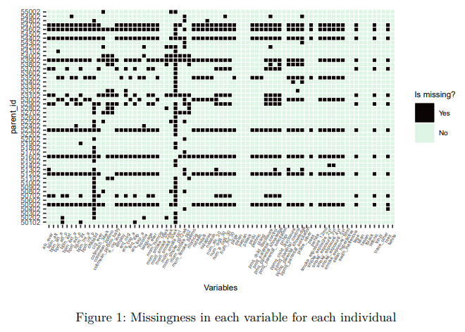
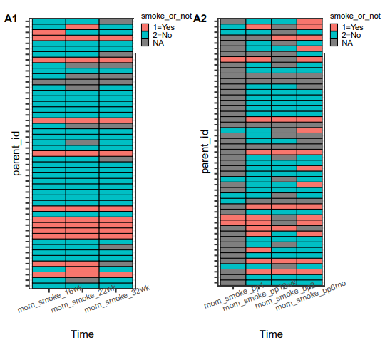

# Project 1: Exploring the Association Between SDP/ETS and Self-Regulation, Externalizing Behavior, and Substance Use

With the data which contain 49 individuals and 79 variables, we explored the missing patterns and did basic exploratory analysis on the variables.

In the report.pdf file, we first introduced the study aim and an overview of the data, with some tables listed summary statistics of variables of interest. Then in the Method and Result section, we examine the relationship between the three categories of outcomes and SDP/ETS. We also examine the within outcome and within predictor relationships, mostly with figures (Lasagna plots, scatter plots, box plots).

The overall conclusion is that, due to the poor quality of the data, we can't draw any useful conclusion on how SDP/ETS is affecting Self-Regulation, Externalizing Behavior, and Substance Use.

## Repository Structure

+ `report.qmd`: the code that generate the report.pdf

+ `report.rmd`: main report which contain main text and a pure code Appendix.

+ `./pre-processing`: Some preprocessing with the raw data

+ `./Figures`: the folders that contains selected figures

Note that due to data privacy, the repository would not contain either the original data or the cleaned data we used in this study.

## Report Overview
The report within this repository is structured to guide the reader through the methodology and findings:

**Introduction**: Discusses the significance of the study and its objectives.

**Data:** Provides an overview of the dataset used, including variables and collection methods.

**Methods:** Details the data preprocessing steps, statistical analyses performed, and the approach for visualizing results.

**Results:** Highlights the key findings, including patterns in missing data, variable summaries, and the impacts of SDP/ETS on the outcomes studied.

**Limitations:** Acknowledges the potential limitations and the scope of the study.

**References:** Cites the academic references that underpin the analysis and conclusions.

## Selected Figures

## Quick Start
To replicate or extend the study:

+ Clone this repository to your local machine.

+ Explore the report.qmd source code to review the analysis scripts.

+ Figures and detailed report findings can be referenced in the report.pdf
